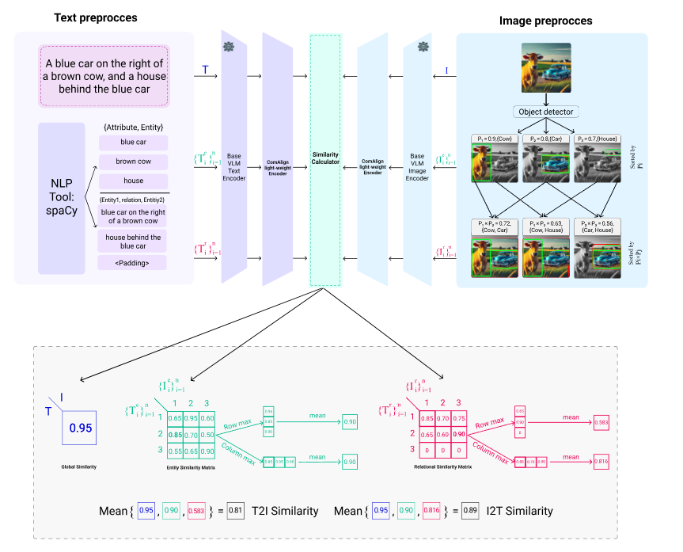

# ComAlign: Compositional Alignment in Vision-Language Models

This repository accompanies the research on Compositional Alignment (ComAlign), a fine-grained approach designed to improve the compositional understanding in Vision-Language Models (VLMs). While existing VLMs, such as CLIP, excel at extracting transferable features for downstream tasks, their training processes typically rely on coarse-grained contrastive loss between global image and text embeddings. This coarse alignment often overlooks the finer compositional structures in both modalities, such as attribute binding and object relationships.

In our research, we introduce Compositional Alignment (ComAlign), a method that focuses on achieving a more precise alignment between the components of image and text pairs. Our approach leverages weak supervision (in the form of image-text pairs) and ensures that the fine-grain components are retained across both modalities. By training a lightweight network on top of existing visual and language encoders, ComAlign enhances the alignment of fine-grained components, improving the models' ability in compositional understanding.

We demonstrate ComAlign's effectiveness through experimental results on multiple VLMs and datasets, showing significant improvements in retrieval tasks and compositional benchmarks.

Below is an overview of the ComAlign pipeline, detailing how we match the components of one modality to their corresponding components in the other modality:



This repository provides the checkpoints for the ComAlign model across different base VLMs and the code to evaluate the proposed model on the retrieval tasks.

## Repository

Install Libraries
```bash
git clone https://github.com/aliabdollahi024/ComAlign.git
cd ComAlign
pip install -r requirements.txt
```

Download Data

```bash
wget http://images.cocodataset.org/zips/val2017.zip
unzip val2017.zip
wget http://images.cocodataset.org/annotations/annotations_trainval2017.zip
gdown https://drive.google.com/uc?id=1vloi1qL85bM8yNgRQsRWyIX1gMHD4tj-
gdown https://drive.google.com/uc?id=1LJiC0LznQBBMu-hbM2Edmzdul22u2E7y
gdown https://drive.google.com/uc?id=1QxCig_UP5fCORMeCeNRtrycktZHXQOvS
unzip embeddings.zip
```


### 1. **Experiments**

#### 1.2. **Retrieval Experiment**

In this version, we have only provided the checkpoint for CLIP-VIT-B32. In future updates, we will gradually introduce the checkpoints and embedding files for other base VLMs.

 Model             | Checkpoint Link                                | COCO-Val Embeddings Link                                |
|-------------------|------------------------------------------------|------------------------------------------------|
| **CLIP-VIT-B32**   | [Link to ComAlign-CLIP-VIT-B32 Checkpoint](https://drive.google.com/uc?id=1QxCig_UP5fCORMeCeNRtrycktZHXQOvS)        | [Link to COCO-Val embedded by CLIP-VIT-B32](https://drive.google.com/uc?id=1vloi1qL85bM8yNgRQsRWyIX1gMHD4tj-)        |


```
python inference.py 
```

